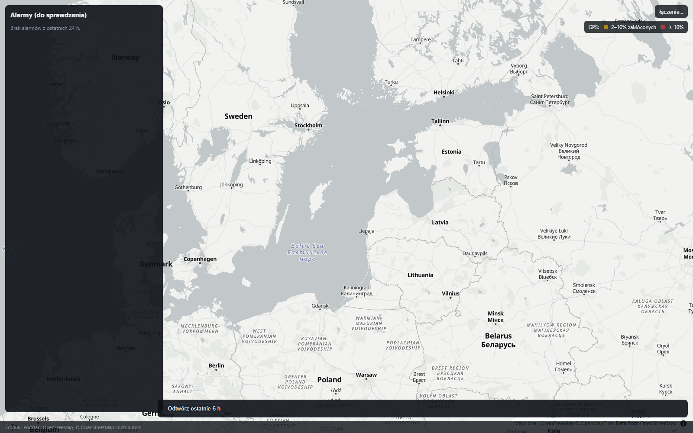
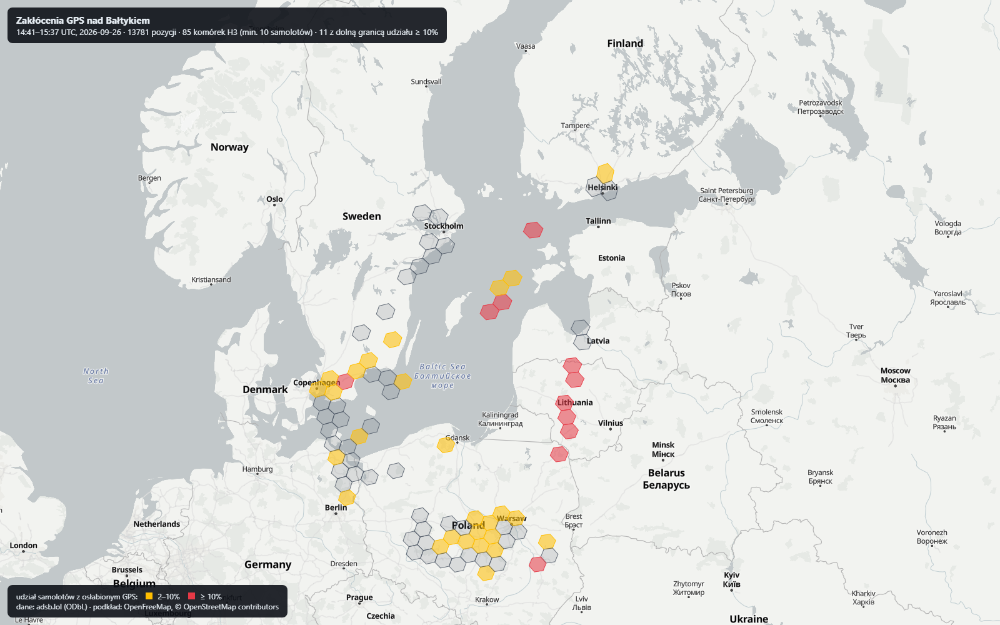

# WACHTA

Mapa świadomości sytuacyjnej Bałtyku budowana wyłącznie z danych publicznych. Każdy rekord ma
źródło, czas pobrania i licencję; każdy detektor ma zmierzoną jakość na zamrożonych danych.

> Stan: budowa, faza F0/F1. Projekt niekomercyjny, portfolio.
> Plan: [docs/PLAN.md](docs/PLAN.md) · [docs/PLAN-DZIALANIA.md](docs/PLAN-DZIALANIA.md) ·
> [plan wykonawczy F0+F1](docs/superpowers/plans/2026-09-22-f0-f1-fundament-powietrze.md) ·
> stan prac: [docs/STATUS.md](docs/STATUS.md)

---

## 1. Czym to jest

Sześć kontenerów w jednym `compose.yaml`. Usługa `ingestion` (C#) co minutę pobiera pozycje samolotów
z adsb.lol i zapisuje je do PostgreSQL-a z TimescaleDB. Usługa `detectors` (Python) w pętli liczy dwa
detektory zachowań i model pokrycia odbiorników. Usługa `api` (C#) wystawia to jako REST i SignalR,
a `web` (React + MapLibre + deck.gl) rysuje na mapie.

Różnica wobec gotowych map typu World Monitor: WACHTA nie agreguje cudzych list alertów, tylko liczy
własne detektory na surowych danych, trzyma przy każdym rekordzie jego rodowód i mierzy jakość
detektorów w CI (pipeline odrzuca zmianę pogarszającą metrykę o więcej niż 5 punktów procentowych).

## 2. Co potrafi

### W uruchomionym stosie (Docker) — to działa

| Element | Szczegóły |
|---|---|
| Pobieranie ADS-B | adsb.lol (ODbL 1.0), trzy źródła: `adsblol-mil`, `adsblol-baltic-n`, `adsblol-baltic-s` |
| Detektor **D1** | samolot przestaje nadawać w locie, choć obszar ma dobre pokrycie i inne maszyny widać |
| Detektor **D3** | komórki H3 z osłabioną dokładnością GPS, liczone z pól NIC/NACp w ADS-B |
| Model pokrycia | godzinowa mapa tego, gdzie odbiorniki w ogóle słyszą — wejście dla D1 |
| API | 6 endpointów REST + hub SignalR `/hubs/live` + OpenAPI |
| Mapa | samoloty na żywo, panel alarmów, legenda zakłóceń GPS, pasek odtwarzania, stopka źródeł |

D1 milczy przez pierwsze kilka godzin po czystym starcie — dopóki model pokrycia się nie zapełni,
nie ma podstawy, żeby odróżnić ciszę samolotu od dziury w zasięgu odbiorników.

Samolot z zakłóconym GPS przestaje podawać pozycję, ale **nadal nadaje** — dlatego D1 liczy ciszę
w transmisji (tabela `aircraft_contact`), a nie brak pozycji. Bez tego rozróżnienia zakłócanie nad
Bałtykiem generowałoby fałszywe alarmy.

Każdy wynik detektora jest oznaczony jako **„do sprawdzenia”**, nigdy jako zarzut.

### Co chodzi w pętli, a co nadal tylko w skryptach

Ta granica przesuwa się w miarę pracy, więc jest tu wypisana wprost — README, który jej nie
pilnuje, zaczyna kłamać po kilku dniach.

**W działającym stosie**, liczone same, z alarmami trafiającymi do bazy i na mapę:

| Detektor | Co wykrywa | Źródło |
|---|---|---|
| D1 | samolot przestaje nadawać mimo działającego odbioru | ADS-B (adsb.lol) |
| D3 | zakłócenia GPS w komórce H3 | ADS-B |
| D4 | statek milknie na AIS w ruchu | AIS (Digitraffic) |
| D5 | dwa statki burta w burtę poza kotwicowiskiem | AIS |
| D6 | podejrzenie wleczenia kotwicy po kablu | AIS + kable z OSM |
| D7 | jeden numer MMSI w dwóch miejscach | AIS |

Do tego: model pokrycia odbiorników, indeksowanie alarmów do bazy wektorowej (co 15 min,
przyrostowo) i wyszukiwanie po znaczeniu przez `/api/search`.

**Poza pętlą — kod jest i jest zmierzony, ale nikt go cyklicznie nie uruchamia:**

| Obszar | Moduł | Jak dziś działa |
|---|---|---|
| Tor wyścigowy, samolot na dyżurze (D2) | `racetrack.py` | `eval/feasibility/fetch_traces.py` na żądanie |
| Nietypowe skupiska doniesień (D8) | `anomalies.py` | `run_anomalies.py` na pobranym GDELT |
| Ciemny STS (złożenie D4 i D5) | `dark_sts.py` | `run_dark_sts.py` na dobie duńskiego AIS |
| Sankcje i flota cieni | `sanctions.py` | `fetch_sanctions.py`, wzbogaca wyniki skryptów |
| Dwie wersje wydarzenia | `versions.py` | `fetch_versions.py` |
| Linia frontu, wsparcie dla Ukrainy | — | `fetch_frontline.py`, `fetch_aid.py`, widoczne na statycznym demo |
| Model ML dla D3 | `jamming_features.py` | `eval/train_jamming.py`; regułą dalej liczy detektor |

Statyczna mapa `docs/demo/index.html` pokazuje **wszystkie** te warstwy naraz, ale jako migawkę
z konkretnej chwili. Aplikacja pod `http://localhost:8083` pokazuje mniej warstw, za to na żywo.

## 3. Jak to uruchomić

Pełna instrukcja, sprawdzona krok po kroku: **[docs/URUCHOMIENIE.md](docs/URUCHOMIENIE.md)**.
Skrót:

```bash
cp .env.example .env          # ustaw POSTGRES_PASSWORD - bez niego baza nie wstanie
docker compose up -d --build  # baza, migracje, pobieranie, API, detektory, mapa
```

Pierwsze uruchomienie jest długie: sam obraz `timescale/timescaledb-ha:pg17` waży 4 GB.
Kontener `migrator` po pracy wychodzi z kodem 0 — status `Exited` jest poprawny.

- Mapa: `http://localhost:8081`
- API i OpenAPI: `http://localhost:8080/openapi/v1.json`

Oba porty zmienia się w `.env` (`WACHTA_WEB_PORT`, `WACHTA_API_PORT`), bez edycji `compose.yaml` —
8081 często jest już zajęte przez inne lokalne narzędzia.

Tryb deweloperski frontu (Vite z proxy do API): `cd web && npm run dev` → `http://localhost:5173`

Sprawdzenie środowiska przed startem: `scripts\bootstrap.ps1`.



### API

| Endpoint | Uwagi |
|---|---|
| `GET /api/aircraft/live` | pozycje z ostatniej chwili; **nie** `/api/live`. Opcjonalne `militaryOnly`, `minLat`/`minLon`/`maxLat`/`maxLon` |
| `GET /api/aircraft/{hex}/track` | **wymaga** `from` i `to`; bez nich 400. Okno musi być dodatnie i nie dłuższe niż 24 h |
| `GET /api/alerts` | opcjonalne `since` |
| `GET /api/jamming` | opcjonalne `at` |
| `GET /api/replay` | **wymaga** `from` i `to`; opcjonalne `militaryOnly` |
| `GET /api/sources` | rodowód: źródła i licencje |
| `/hubs/live` | SignalR |

## 4. Metryki

Liczone na zamrożonych danych przez `eval/run_eval.py`; bramka w CI odrzuca zmianę, która pogarsza
wynik o więcej niż 5 punktów procentowych. Linia bazowa: `eval/baseline.json`, stan na 2026-09-26.

| Detektor | Precyzja | Recall | Na czym liczone |
|---|---|---|---|
| **D3** (zakłócenia GPS) | **0,60** | **0,75** | godzina prawdziwych danych (13 781 pozycji) wobec **niezależnej referencji**: dziennych plików H3 z gpsjam.org (8 komórek zakłóconych, 22 czyste) |
| D1 (zgaszony transponder) — syntetyczne | 1,00 | 1,00 | 10 scenariuszy reguły; to test regresji, **nie** miara jakości |
| **D6** (wleczenie kotwicy nad kablem) | — | — | mierzony inaczej: fałszywe alarmy na dobę prawdziwego ruchu (niżej) |
| **D8** (nietypowe skupisko doniesień) | — | — | próg to prawdopodobieństwo Poissona < 0,01 wobec własnego tła miejsca, nie krotność |
| D1 — rzeczywiste | — | — | **jeszcze nie istnieje**; powstanie po tygodniu zbierania, z ręcznie oznaczonej próby milczących samolotów (także tych, których detektor nie zgłosił) |

Referencja gpsjam pochodzi z poprzedniej doby i agreguje cały dzień, a nasz pomiar to jedna godzina —
zgodność jest z natury częściowa, więc recall liczony w ten sposób jest raczej zaniżony niż zawyżony.

### D6 — ile fałszywych alarmów na prawdziwym ruchu

Detektor przepuszczony przez **pełną dobę duńskiego AIS** (25.12.2024, 904 statki z trasą w pobliżu kabli):

| Zakres | Alarmy / dobę | Na godzinę |
|---|---|---|
| wszystkie statki | 35 | **1,46** |
| tylko handlowe (Cargo, Tanker, Passenger) | 1 | **0,04** |

Różnica nie bierze się z progu, tylko z tego, **kto** alarmuje. Wśród 35 alarmów 26 to jednostki
o typie „Undefined”, a nazwy kabli mówią resztę: Ostwind, Kriegers Flak, Fehmarn Belt, Kontek —
to statki pracujące przy tych właśnie liniach, plus dwa kutry rybackie. Wolne, nieregularne krążenie
nad kablem jest ich zawodem. D6 jest więc detektorem dla ruchu handlowego; jednostki robocze i rybackie
idą na osobną listę, nie do tego samego strumienia alarmów.

Zastrzeżenie: dane duńskie nie obejmują Zatoki Fińskiej, więc **samego incydentu Eagle S w nich nie ma**.
Zmierzone jest to, co dla detektora najgroźniejsze — poziom szumu na normalnym ruchu; potwierdzenie
na prawdziwym incydencie wymaga historycznego AIS z wód fińskich.



Poziom komórki liczy się z **dolnej granicy przedziału ufności Wilsona**, nie z surowego udziału.
Przy surowym udziale i pięciu samolotach w komórce jeden zakłócony to od razu 20% — i na prawdziwej
godzinie danych 154 z 274 komórek wychodziło jako „wysokie”, także nad Niemcami i środkową Polską.
Po zmianie: 11 komórek wysokich, z czego 82% w promieniu 400 km od zmierzonego ogniska zakłóceń.

## 5. Architektura

```
adsb.lol ──► Wachta.Ingestion (C#, .NET 10)  ──┐
                adaptery + limit zapytań       │
                                               ▼
                                    PostgreSQL 17 + TimescaleDB
                                    PostGIS + pgvector
                                               │
                        ┌──────────────────────┼───────────────────────┐
                        ▼                      ▼                       ▼
              detectors (Python)        Wachta.Api (C#)          eval/ (metryki)
              D1, D3, pokrycie          REST + SignalR           bramka w CI
                                               │
                                               ▼
                                    web (React, MapLibre, deck.gl)
```

Decyzje: [docs/adr/](docs/adr/) — jedna baza zamiast czterech systemów, brak Redisa w F1,
podział pracy między C# i Pythona.

## 6. Źródła i licencje

Pełna macierz: [docs/SOURCES.md](docs/SOURCES.md). W F1 dane w stosie pochodzą wyłącznie z **adsb.lol**
(ODbL 1.0, niefiltrowane, endpoint wojskowy i dwa obszary bałtyckie). Podkład mapy: OpenFreeMap,
© OpenStreetMap contributors.

## 7. Testy

```bash
python -m pytest -q                                    # detektory, z korzenia repozytorium
cd src/python && python -m pytest tests/integration -q # integracyjne, wymagają Dockera
python eval/run_eval.py --check eval/baseline.json     # bramka jakości detektorów
cd src/dotnet && dotnet test                           # C#, wymaga .NET 10 SDK i Dockera
cd web && npm test && npm run build                    # front: testy i kontrola typów
cd web && npm run test:ui                              # front: testy w przeglądarce (Playwright)
```

Wszystko naraz, z pominięciem tego, czego nie da się uruchomić: `scripts\check.ps1`.
Liczby testów i typowe potknięcia (SDK poza PATH, `curl` w PowerShellu) opisuje
[docs/URUCHOMIENIE.md](docs/URUCHOMIENIE.md), sekcja 7.

## 8. Etyka i prawo

Tylko dane publiczne. Bez śledzenia osób prywatnych. Demo lokalne; dane ze stref działań wojennych
publikowane wyłącznie z opóźnieniem. Szczegóły w [docs/PLAN.md](docs/PLAN.md), sekcja 13.
