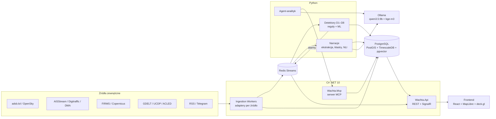

# WACHTA — własna mapa sytuacyjna świata (OSINT)

> Nazwa robocza. Stan: plan, nic nie zaimplementowane. Data: 2026-09-22.

## 0. Po co i czym się różni

Mapa świata, na której każdego dnia widać: wojny i zdarzenia na lądzie, ruch wojskowy w powietrzu,
flotę cieni na morzu — oraz **co z tego jest nietypowe** i **kto to podaje**.

Mapy typu World Monitor (59k gwiazdek), War Monitor, battleMap już istnieją. One **agregują i wyświetlają**.
WACHTA ma cztery rzeczy, których tam nie ma albo są płytkie:

1. **Własne detektory zachowań**, nie gotowe listy: samolot gaśnie w zasięgu odbiorników, tankowiec krąży
   po torze tankowania, statki stoją burta w burtę na otwartym morzu, statek wlecze kotwicę nad kablem.
2. **„Kto co podaje”** — każdy punkt na mapie ma rodowód: źródło, godzina pobrania, licencja, poziom zaufania.
   Dla zdarzeń lądowych widok **„Dwie wersje”**: jak to samo zdarzenie opisują media UA / RU / zachodnie / PL.
3. **Agent-analityk** — dostaje alarm, sam dobiera narzędzia (przez własny serwer MCP) i pisze raport z dowodami.
4. **Mierzalność** — każdy detektor ma zbiór testowy ze znanych incydentów i metryki w CI.

Pokrycie oferty: Python, C#, Git, LLM, RAG, GenAI, agenci, wzorce projektowe, baza wektorowa, ML nie-LLM,
Docker, Azure DevOps — każdy element ma w projekcie realną robotę (sekcja 10).

---

## 1. Warstwy mapy

| Warstwa | Co widać | Odświeżanie |
|---|---|---|
| **Powietrze** | samoloty wojskowe i państwowe, tory tankowania, „zgaszone” samoloty, zakłócenia GPS (heksy) | 5–15 s |
| **Morze** | statki w AOI, flota cieni (sankcje), luki AIS, przeładunki STS, krążenie przy kablach | 1–5 min |
| **Ląd / konflikt** | zdarzenia (uderzenia, walki, alarmy), pożary z satelity, linie frontu (tylko z licencją) | 15 min – 1 dzień |
| **Infrastruktura** | kable podmorskie, rurociągi, elektrownie, porty, lotniska | statyczne |
| **Sygnały pośrednie** | awarie internetu (IODA/Cloudflare Radar), NOTAM-y (zamknięte strefy) | 5–60 min |
| **Narracje** | klastry newsów przypięte do zdarzeń, widok „Dwie wersje” | 15 min |

Suwak czasu (replay) dla wszystkich warstw — kluczowy do analizy incydentów „co się działo 3 godziny przed”.

**AOI (obszary zainteresowania) w MVP:** Bałtyk + Polska/kraje bałtyckie, Morze Czarne + Ukraina.
Reszta świata później — inaczej dane zjedzą dysk i limity API.

---

## 2. Detektory (serce projektu)

Każdy detektor: najpierw **reguła bazowa** (prosta, wytłumaczalna), potem **model ML**, który ma ją pobić
na tym samym zbiorze testowym. Jeśli nie pobije — zostaje reguła i to też jest wynik.

### Powietrze

**D1. Zgaszony transponder („dark aircraft”)**
- Sygnał: samolot nadawał, nagle zniknął w powietrzu (wysokość > 3000 ft, nie przy lotnisku), a obszar ma pokrycie odbiorników.
- Pułapka: 90% „zniknięć” to dziury w zasięgu. Dlatego **model pokrycia**: siatka H3 z liczbą raportów/odbiorników z ostatnich 7 dni. Alarm tylko w komórkach z dobrym pokryciem, nie na krawędzi.
- Dodatkowo: samolot wojskowy znika blisko granicy strefy konfliktu → wyższy priorytet.
- ML: klasyfikator „dziura w zasięgu vs świadome wyłączenie” (gradient boosting na cechach: pokrycie komórki, wysokość, prędkość, typ, odległość od granicy/lotniska, historia tego ICAO).
- Ograniczenie: wiele samolotów wojskowych w ogóle nie nadaje ADS-B (tylko Mode-S albo nic). Widzimy wyłącznie te, które nadawały i przestały — README musi to mówić wprost.

**D2. Tankowanie w powietrzu**
- Tankowce (KC-135, KC-46, A330 MRTT…) rozpoznane po typie i adresie ICAO z bazy samolotów (tar1090-db / Mictronics).
- Wzorzec: **tor wyścigowy** (racetrack) — powtarzalne zawracanie o 180°, stała wysokość, 1–3 h.
- Odbiorcy: myśliwce zwykle niewidoczne, ale gdy widać — 1+ samolot w odległości < 2 NM, ±500 ft, ten sam kurs.
- ML: klasyfikator kształtu toru (cechy: krzywizna, liczba zawrotów, wariancja wysokości) → potem sekwencyjny model (1D-CNN) na surowym torze.
- **Zbudowane regułowo (2026-09-27)**, `racetrack.py`. Kryterium rozdzielające tor od krążenia to **najdłuższa prosta noga**, nie suma obrotu: prawoskrętny tor wyścigowy kumuluje pełne 360° na okrążenie dokładnie jak okrąg, więc obrót niczego nie rozstrzyga. Tor ma nogi ≥ 25 km, okrąg nie ma żadnej.
- Zmierzone na 47 torach wojskowych (adsb.lol, 2026-09-27): wzorzec u **2 z 5 tankowców**, **0 z 36** pozostałych samolotów, 0 z 4 rozpoznawczych, 1 z 2 bez typu. Brak fali fałszywych alarmów; czułość nieznana, bo nie wiadomo, ile z tych 5 tankowców faktycznie pełniło dyżur.
- Typ KC-46A zgłasza się jako `B762` (płatowiec 767-2C) — mapowanie ważne wyłącznie w obrębie listy `/v2/mil`, poza nią to zwykły samolot pasażerski.
- Ograniczenie: segment przycinany progiem `max_radius_km = 90`, więc bardzo rozległy tor zostanie pocięty na kilka wpisów (widać to na 17-46037: 263 + 114 + 79 + 55 min).

**D3. Zakłócanie i fałszowanie GPS (jamming / spoofing)**
- Jamming: samoloty raportują obniżone NIC/NACp → agregacja w heksach H3 co godzinę (metoda jak gpsjam.org).
- Poziom komórki liczony z **dolnej granicy przedziału ufności Wilsona**, min. 10 samolotów na komórkę. Sprawdzone na godzinie prawdziwych danych (2026-09-26): surowy udział przy 5 samolotach dawał 154 z 274 komórek jako „wysokie”, także nad Niemcami; po zmianie 11 komórek, 82% w promieniu 400 km od ogniska zakłóceń.
- Spoofing: pozycja skacze, niemożliwa prędkość, samoloty „krążą” po okręgu w jednym punkcie.
- Rozwój: lokalizacja źródła zakłóceń metodą najmniejszych kwadratów (są publikacje naukowe o tym z ADS-B).

### Morze

**D4. Podejrzana luka AIS**
- **Luka ≠ wyłączenie nadajnika.** AISStream i Digitraffic to odbiorniki naziemne (zasięg ok. 20–40 NM od brzegu); na otwartym morzu, przy przeciążeniu kanału albo awarii odbiornika luka jest normalna. Dlatego detektor nazywa się „podejrzana luka”, a nie „wyłączył AIS”.
- Reguła: przerwa > N godzin **i** w tej samej komórce H3 w tym czasie inne statki nadal były odbierane (dowód, że pokrycie działało) **i** statek nie wszedł do portu. Priorytet dla statków z list sankcyjnych.
- Punkt odniesienia: zdarzenia „gap” z Global Fishing Watch — liczone z AIS satelitarnego, więc widzą to, czego nie widzą odbiorniki naziemne. Służą jako etykiety do ewaluacji, nie jako gotowy wynik.
- **Zbudowane (2026-09-27)**, `gaps.py`, 18 testów. Każda luka dostaje dwie niezależne oceny, bo mieszanie ich dawało śmieci:
  - **odbiór** — ile innych statków słychać było w tej samej kratce w czasie ciszy (świadkowie), oraz ilu innym urwało się nadawanie tam w tej samej chwili (to znak awarii stacji, nie decyzji załóg);
  - **ruch** — prędkość wyliczona z przebytej drogi: poniżej 2 w. statek po prostu stał, powyżej 30 w. żaden kadłub tego nie zrobił, więc to błąd danych, a nie ciemny rejs.
- Pomiar na dobie duńskiego AIS (aisdk-2024-12-25, 15,0 mln wierszy, **1740 statków**, prostokąt 54,5–58,0 N / 9–14 E): 91 luk ≥ 45 min → 78 przy czynnym odbiorze → 72 w ruchu → **4 po odrzuceniu tych, które tłumaczy wypłynięcie poza prostokąt**. To około **4 alarmy na dobę na 1740 statków**.
- Test brzegu jest arytmetyczny, nie uznaniowy: przy 25 w. statek pokonuje 46 km/h, więc jeśli krawędź prostokąta jest dalej niż połowa tego, co mógł przepłynąć, to go nie opuścił i cisza wydarzyła się w danych, które mamy.
- Pułapka, której o mało nie przeoczyłem: fixture zbudowany dla D6 zawierał tylko ruch **w pobliżu kabli**, więc każdy statek wypływający poza ten obszar udawałby lukę. Stąd osobny odczyt tej samej doby prostokątem.
- Znalezisko: **STANISLAV GOVORUKHIN** (MMSI 273258520, IMO 9621596, bandera RU, lista `ua_war_sanctions`) — 46 min ciszy przy 11,4 w. przed zaniknięciem, pojawił się 16,3 km dalej, a w tym czasie w tej samej kratce słychać było 12 innych statków. Pozycja 54,97 N / 13,56 E, na południe od Bornholmu. Dopasowanie potwierdzone dwustronnie: numer MMSI i nazwa z AIS zgadzają się z wpisem na liście.

**D5. Przeładunek burta w burtę (STS)**
- Reguła: 2 statki < 500 m, prędkość < 1 węzeł, > 2 h, poza kotwicowiskiem i portem, przynajmniej jeden tankowiec.
- Odniesienie: zdarzenia „encounter” z GFW.
- **Ciemny STS zbudowany (2026-09-27)**, `dark_sts.py`, 12 testów — złożenie D4 i D5, nie nowy pomiar.
  - Łączy **postój w otwartej wodzie bez widocznego sąsiada** z **cudzą niewyjaśnioną ciszą AIS** obok, nakładającą się w czasie.
  - Sama bliskość okazała się bezwartościowa: przy promieniu 10 km detektor wskazał holownik FAIRPLAY-30 stojący na budowie tunelu Fehmarn, obok którego w ciągu doby zamilkły cztery różne statki po prostu przepływające cieśniną.
  - Zastąpione **testem wykonalności drogi**: zgaszony statek musiał zdążyć podejść do stojącego, postać co najmniej 30 min i wrócić na trasę w czasie swojej ciszy (`droga = zanikniecie → postój → powrót`, tempo 12 w.). To ta sama arytmetyka co test brzegu w D4.
  - Wynik na dobie 2024-12-25: 1291 postojów → 300 bez widocznego sąsiada → 98 poza kotwicowiskiem → **1 para po teście drogi → 0 po odrzuceniu jednostek służbowych** (pozostała była szwedzką jednostką straży przybrzeżnej).
  - Zero jest potwierdzone czułością, nie przyjęte na wiarę. Rozluźnianie progów daje monotoniczną odpowiedź: 1 → 2 → 5 → 8 → 16, więc łańcuch działa, a zero bierze się z progów.
  - Nie ma warstwy na mapie, bo nie ma czego rysować. Pusta warstwa przeszłaby przez bramkę jako „jest” i to byłoby kłamstwo.
- **Zbudowane (2026-09-27)**, `sts.py`, 17 testów. Trzy warunki, każdy dodany dopiero po tym, jak poprzedni wynik okazał się bezużyteczny:
  1. **kotwicowiska wyprowadzone z ruchu** (kratka, w której przez dobę stało ≥ 12 różnych statków) — bez tego 14 467 z 17 586 spotkań to statki czekające obok siebie;
  2. **oba statki musiały gdzieś płynąć** w ciągu 6 h wokół spotkania (prędkość z pola SOG albo wyliczona z pozycji, gdy pola brak) — bez tego zostawało 3119 „przeładunków”, czyli kutry przywiązane do kei przez całą dobę;
  3. **typ statku** — para ładunkowiec/tankowiec, bo pilotówki, holowniki i łodzie serwisowe podchodzą burta w burtę z zawodu.
- Ścieżka liczb na dobie 2024-12-25 (1740 statków): 12 451 spotkań ≥ 30 min → 2648 poza kotwicowiskiem → 129 gdzie oba statki płynęły → **11 par ładunkowiec/tankowiec**.
- Prawie wszystkie leżą przy Skagen (57,6–57,7 N), czyli w największym europejskim miejscu bunkrowania paliwa. To znaczy, że detektor działa — i że sam kształt zdarzenia nie odróżnia legalnego bunkrowania od przeładunku ropy poza rejestrem. Do tego trzeba ładunku, tras i list.
- Błąd znaleziony mutacją przed testami: połowiczne sąsiedztwo w siatce gubiło pary leżące po dwóch stronach granicy kratki, gdy porządek numerów MMSI był przeciwny do porządku kratek. Test `test_pair_split_across_grid_cells_is_still_found` czerwienieje po przywróceniu tamtej wersji.

**Rodzaj wykazu, nie „lista sankcyjna”** (poprawka 2026-09-27)
- Ponad połowa pliku OpenSanctions maritime to **inspekcje i zatrzymania portowe** (Tokyo/Paris/Abuja/Black Sea MoU), a nie sankcje. Statek zatrzymany za przeciekającą pompę zeznaje o swoim stanie technicznym, nie o tym, czyj wozi ładunek.
- Z 90 statków Zatoki Fińskiej dopasowanych do wykazu **51 jest na listach sankcyjnych, 38 to protokoły inspekcji, 1 to raport badawczy**. Wcześniejsza etykieta na mapie („na listach sankcji/ryzyka: 90”) była nieprawdziwa dla 43% z nich.
- `SanctionMatch.category` zwraca teraz `sankcje` / `inspekcje portowe` / `raport badawczy` / `lista nieokreslona`; mapa pokazuje rozbicie, a dymek statku mówi wprost, czym jest wykaz.

**D6. Zagrożenie infrastruktury (wzorzec Eagle S)**
- Reguła: statek w buforze kabla/rurociągu z prędkością 1–7 węzłów i nieregularnym kursem albo zatrzymaniem = możliwe wleczenie kotwicy.
- Trasy z OpenStreetMap (+ rurociągi z EMODnet), nie z TeleGeography (tamte są schematyczne). Bufor dobrany do dokładności trasy (np. 1–3 km) i sprawdzony na znanych incydentach — za wąski gubi incydenty, za szeroki alarmuje przy każdym przepływającym statku.
- **Detektor dotyczy ruchu handlowego.** Zmierzone na dobie duńskiego AIS (25.12.2024): dla wszystkich statków
  35 alarmów na dobę (1,46/h), po ograniczeniu do Cargo/Tanker/Passenger — 1 alarm na dobę (0,04/h). 26 z 35
  alarmów to jednostki robocze przy Ostwind, Kriegers Flak, Fehmarn Belt i Kontek: wolne krążenie nad kablem
  jest ich zawodem. Jednostki robocze i rybackie idą na osobną listę, nie do tego samego strumienia.
- Wydajność: przy pół miliona pozycji na dobę liczenie odległości do każdego odcinka jest nie do przejścia —
  stąd `spatial_index.py` (siatka komórek 0,2°, promień szukania liczony osobno dla szerokości i długości).
- Ewaluacja: odtworzenie znanych incydentów (Eagle S — Estlink 2, 25.12.2024; Yi Peng 3 — listopad 2024; Vezhen — styczeń 2025) — detektor musi je złapać w danych historycznych i nie alarmować co godzinę przy normalnym ruchu.

**D7. Tożsamość statku** — **zbudowane (2026-09-27)**, `identity.py`, 18 testów.
- Punkt wyjścia: numer MMSI to nie statek, tylko liczba wpisana do radia. Jeden kadłub nie może być w dwóch miejscach, więc tor przeskakujący tam i z powrotem szybciej, niż cokolwiek płynie, to nie jest jeden statek.
- Rozdzielone **dwa przypadki**, bo wołają o różną reakcję: `bledny punkt` (jedna pozycja poza torem — błąd odczytu, nudne i częste) i `dwa kadluby` (tor na przemian wraca między oddalonymi skupiskami, z prawdziwymi odcinkami spójnego ruchu po obu stronach, min. 3 pozycje każdy).
- **Prefiksy ITU**: numery `111xxxxxx` to statki powietrzne SAR, `99` znaki nawigacyjne, `98` jednostki pomocnicze, `97` nadajniki ratunkowe, `00` stacje brzegowe. Bez tej tabeli detektor ogłosił cztery duńskie śmigłowce ratownicze jako podszywanie się — 160 węzłów to dla nich norma. Po dodaniu: 5 → 1 przypadek.
- Wynik na dobie 2024-12-25 (1740 numerów): 27 z niemożliwym skokiem → 26 to pojedyncze błędne punkty → **1 przypadek „dwa kadłuby"**.
- Ten jeden to **RAGNA** (MMSI 219006091, prom pasażerski). Stoi przy nabrzeżu z prędkością 0,0 przez większość doby, ale o 13:39–13:42 pod tym samym numerem biegnie **spójny czteropunktowy tor** 40 km dalej, przy 9–14 w., z płynnie narastającą pozycją. To nie jest jeden przekłamany punkt, tylko drugi tor.
- Czego to nie dowodzi: odbiornik mylący bity w cudzej wiadomości przypisze ją do sąsiedniego numeru i wygląda to tak samo. Krótkie wyskoki w tym samym torze (03:38–03:40) są właśnie tym.
- Nazwy: tylko 1 numer w dobie nadawał więcej niż jedną nazwę, i była to `LANGELAND` vs `LANGELANDC]6` — czyli przekłamany ciąg znaków, nie zmiana tożsamości. Sygnał okazał się zdominowany przez błędy dekodowania.
- Zmiany nazwy / bandery / MMSI przy tym samym IMO, dwa statki z tym samym MMSI naraz, teleportacje (spoofing AIS).
- **Baza wektorowa:** embedding „odcisku” statku (dane statyczne + wzorzec tras) → „pokaż statki podobne do Eagle S”, wykrywanie tego samego kadłuba pod nową tożsamością.

### Ląd

**D8. Kandydat na zdarzenie (uderzenie / pożar)**
- Fuzja: punkt pożaru z NASA FIRMS w strefie konfliktu (poza sezonem wypalania pól) + klaster newsów w promieniu X km i Y godzin + alarm powietrzny / awaria internetu w regionie.
- Wynik: „kandydat” z listą przesłanek, nie „fakt”.

**D9. „Dwie wersje”** (narracje, sekcja 6).

---

## 3. „Kto co podaje” — źródła danych

### 3a. Macierz źródeł

Legenda dostępu: 🔓 bez klucza · 🔑 darmowy klucz/konto · ✉️ na wniosek · 💰 płatne.
Kolumna **Rola**: *główne* = zasila mapę, *odniesienie* = etykiety do ewaluacji, *kontekst* = dla agenta/RAG.

| Źródło | Co daje | Dostęp | Licencja / uwagi | Rola |
|---|---|---|---|---|
| **adsb.lol** | ADS-B na żywo, endpoint `/v2/mil` (wojskowe), dzienne archiwa na GitHubie | 🔓 (zapowiadany klucz dla feederów) | ODbL, niefiltrowane | główne (powietrze) |
| **airplanes.live** | ADS-B, API zgodne z ADSBx v2 | ✉️ **test 22.09: HTTP 403 — wymaga maila z opisem projektu** | tylko niekomercyjnie | zapasowe (po zgodzie) |
| **OpenSky Network** | stany samolotów, historia lotów | 🔑 OAuth2 client credentials (od 18.03.2026 bez loginu/hasła); 400 zapytań/dzień anonim., 4000 zarejestr. | badania/niekomercyjnie | odniesienie, historia |
| **ADS-B Exchange** | niefiltrowane ADS-B | 💰 (RapidAPI) | komercyjne | opcjonalnie, nie w MVP |
| **Baza samolotów** (tar1090-db / Mictronics) | ICAO hex → rejestracja, typ, flaga wojskowa | 🔓 (pliki) | otwarte | wzbogacanie |
| **AISStream.io** | AIS globalnie przez WebSocket | 🔑 (logowanie GitHub) | tylko z serwera, nie z przeglądarki; brak SLA, brak replay | główne (morze) |
| **Digitraffic (Fintraffic)** | AIS, pozycje + metadane statków (IMO, typ, zanurzenie, cel) | 🔓 | otwarte dane; **test 22.09: tylko wody fińskie (≥ 57,7°N), brak południowego Bałtyku** | główne (Zatoka Fińska) |
| **Duńska Adm. Morska (DMA)** | historyczny AIS w CSV, pliki dzienne ok. 550 MB | 🔓 bucket S3 `aisdata.ais.dk.s3.eu-central-1.amazonaws.com` (host `web.ais.dk` ma zły certyfikat — omijać) | otwarte; **tylko wody duńskie, bez Zatoki Fińskiej** | **sprawdzone 26.09: doba 2024-12-25 pobrana i przefiltrowana** |
| **Global Fishing Watch API v3** | zdarzenia: luki AIS (gaps), spotkania (encounters), loitering, wizyty w portach, tożsamość statków | 🔑 token | **tylko niekomercyjnie** | odniesienie + kontekst |
| **OpenSanctions** | statki, firmy, osoby z list sankcyjnych (UE/UK/USA/UA) z datami | 🔓 pobrania | niekomercyjnie za darmo | wzbogacanie + etykiety |
| **Lista GUR (war-sanctions.gur.gov.ua)** | katalog floty cieni | 🔓 | źródło strony ukraińskiej — oznaczyć jako takie | wzbogacanie |
| **NASA FIRMS** | pożary/hotspoty VIIRS/MODIS, CSV po bbox | 🔑 MAP_KEY; 5000 transakcji / 10 min | NASA, otwarte | główne (ląd) |
| **Copernicus Data Space** | Sentinel-1 (radar, widzi statki bez AIS), Sentinel-2 | 🔑 konto; darmowa kwota PU, potem wolniej | otwarte | faza rozwoju |
| **GDELT** | zdarzenia z newsów co 15 min, globalnie | 🔓 **surowe pliki CSV co 15 min** (DOC API w teście 22.09 dało 2× HTTP 429) | otwarte, dużo szumu | kontekst, klastry |
| **UCDP (GED Candidate)** | zdarzenia zbrojne, miesięcznie | ✉️ token mailem | otwarte z cytowaniem | **odniesienie** (opóźnione, ale sprawdzone) |
| **ACLED** | zdarzenia konfliktowe | 🔑 myACLED + OAuth; **pełne API i dane jednostkowe prawdopodobnie tylko w poziomie Research** | atrybucja obowiązkowa, EULA | odniesienie — do potwierdzenia w F0 |
| **ReliefWeb (ONZ OCHA)** | raporty humanitarne | 🔓 (parametr appname) | otwarte | kontekst (RAG) |
| **Alarmy UA** (alerts.in.ua / ukrainealarm) | alarmy powietrzne w obwodach | 🔑 | niekomercyjnie | sygnał pośredni |
| **IODA / Cloudflare Radar** | awarie internetu wg regionu | 🔓 / 🔑 | otwarte | sygnał pośredni |
| **NOTAM** (FAA / EAD) | zamknięte strefy, strzelania, testy | 🔑 | różne | sygnał pośredni, faza rozwoju |
| **OpenStreetMap (Overpass)** | lotniska, porty, rurociągi, elektrownie | 🔓 | ODbL | infrastruktura |
| **OpenStreetMap — kable podmorskie** | trasy kabli: Estlink 1/2, C-Lion 1, BCS North, EESF-2/3, Balticconnector, Nord Stream (test 22.09: 3327 odcinków w Zatoce Fińskiej) | 🔓 Overpass | ODbL | **infrastruktura dla D6** |
| **EMODnet Human Activities** (UE) | rurociągi (Balticconnector, Nord Stream); kable tylko z krajowych rejestrów DE/NL/FR/NO | 🔓 WFS | otwarte dane UE; **test 22.09: brak kabli w Zatoce Fińskiej** | uzupełnienie |
| **Mapa kabli** (TeleGeography) | trasy kabli — **schematyczne, nie dokładne** | 🔓 | sprawdzić licencję (prawdopodobnie NC) | tylko podgląd, **nie do D6** |
| **Media RSS** | newsy UA, RU, PL, EN | 🔓 | prawa autorskie — przechowujemy fragmenty + link, nie pełne teksty | narracje (start) |
| **Telegram** | oficjalne kanały i kanały frontowe | 🔑 api_id, Telethon | automatyzacja konta użytkownika grozi banem i ma własne warunki API — **opcjonalnie w F5, po sprawdzeniu ToS** | narracje (później) |
| **Linie frontu** (DeepState, ISW) | kontrola terytorium | brak oficjalnego API | **nie scrapujemy bez zgody**; ewentualnie link zewnętrzny | poza MVP |

Wszystko oznaczone „do potwierdzenia” sprawdzamy w F0 (tydzień 0), zanim powstanie konektor.

### 3b. Poziomy zaufania

Każda obserwacja dostaje poziom — UI pokazuje go kolorem, agent musi go uwzględniać:

| Poziom | Typ | Przykład | Uwaga |
|---|---|---|---|
| **T1** | telemetria maszynowa | ADS-B, AIS, FIRMS | obiektywna, ale **da się sfałszować** (spoofing) |
| **T2** | zbiory kuratorowane | UCDP, ACLED, GFW | sprawdzone, ale z opóźnieniem |
| **T3** | źródła oficjalne | MON-y, NOTAM, komunikaty operatorów | wiarygodne co do faktu ogłoszenia, nie zawsze co do treści |
| **T4** | media | RSS, portale | **zawsze z przypisaniem strony** (UA / RU / zachód / PL / inne) |
| **T5** | social | Telegram, X | najszybsze, najmniej pewne |

### 3c. Rodowód w danych (provenance)

Każdy rekord w bazie ma: `source_id`, `fetched_at`, `source_url`, `content_hash`, `license`, `trust_tier`,
`side` (dla mediów), `raw_ref` (wskaźnik do surowego payloadu). Zdarzenie złożone (np. D8) trzyma listę
przesłanek z tymi polami. W UI: każdy panel ma sekcję **„Źródła”**, a warstwy mają stopkę z atrybucją
wymaganą licencją.

---

## 4. Architektura



### Kto co robi w systemie

| Komponent | Język | Odpowiedzialność | Dlaczego tu |
|---|---|---|---|
| **Wachta.Ingestion** | C# (Worker Service) | konektory, normalizacja do wspólnego modelu, deduplikacja, rate-limit, zapis surowych payloadów | długo działające usługi w tle, WebSockety, wysoka przepustowość — .NET robi to dobrze; to jest „C# z prawdziwą robotą” |
| **Wachta.Api** | C# (ASP.NET Core) | REST (OpenAPI), SignalR (push na mapę), obsługa alarmów i spraw | kontrakt dla frontu i agenta |
| **Wachta.Mcp** | C# (ModelContextProtocol.AspNetCore) | narzędzia i zasoby MCP tylko do odczytu | oficjalny SDK C# (Microsoft + Anthropic) |
| **detectors** | Python | D1–D8, model pokrycia, trening i ewaluacja modeli | ekosystem ML (scikit-learn, LightGBM, h3, shapely, movingpandas) |
| **narratives** | Python | ekstrakcja faktów LLM → JSON, klastrowanie wielojęzyczne, NLI, „Dwie wersje” | ekosystem NLP |
| **agent** | Python | Twoja pętla z `wlasny-agent` + klient MCP | reużycie istniejącego kodu |
| **web** | TypeScript | mapa, warstwy, suwak czasu, panele źródeł | MapLibre (darmowe kafle: OpenFreeMap/Protomaps), deck.gl dla tysięcy punktów, H3 dla heksów |

### Kluczowe decyzje techniczne

- **Jedna baza PostgreSQL** z rozszerzeniami zamiast czterech systemów: PostGIS (geometrie, bufory kabli),
  TimescaleDB (tory jako szereg czasowy, kompresja, retencja), pgvector (embeddingi). Obraz `timescaledb-ha` zawiera wszystkie trzy.
  Mniej rzeczy do utrzymania na laptopie; migracja do Qdranta możliwa później za tym samym interfejsem repozytorium.
- **Redis Streams** jako szyna: prosty, i tak potrzebny jako cache. Kafka/NATS to przerost na jeden komputer.
- **Kontrakt między C# a Pythonem:** JSON Schema w `contracts/` → generowane typy po obu stronach + test kontraktu w CI.
- **Budżet danych** (16 GB RAM, jeden dysk): pełna rozdzielczość tylko dla wojskowych i oflagowanych; reszta próbkowana co 60 s,
  retencja 7 dni surowych, kompresja Timescale, agregaty godzinowe na zawsze.
- **GPU (RTX 4060 8 GB):** test 22.09: qwen3.5:9b (Q4_K_M, ctx 2048) zajmuje 5,4 GB, bge-m3 0,66 GB — mieszczą się razem. Przy większym `num_ctx` rośnie cache, więc kontekst trzymamy mały (artykuł ≠ długi dokument), LLM tylko dla nowych klastrów, embeddingi wsadowo.

---

## 5. Model danych (rdzeń)

- `source` — rejestr źródeł (licencja, poziom zaufania, strona, limity).
- `observation` — hipertabela: pozycje ADS-B/AIS (`entity_id, ts, geom, alt, speed, heading, nic, nacp, raw_ref, source_id`).
- `entity` — samolot/statek (ICAO/MMSI/IMO), `entity_identity_history` — zmiany nazw, bander, MMSI.
- `sanction_listing` — wpisy sankcyjne z datą dopisania (etykiety do ewaluacji).
- `alert` — wynik detektora: typ, geom, czas, wynik, **przesłanki** (lista obserwacji), stan (`new → triaged → confirmed | dismissed`).
- `event` — zdarzenie lądowe/złożone z przesłankami.
- `document` + `chunk` (z `embedding vector(1024)` z bge-m3) — newsy, raporty, komunikaty; `claim` — wyciągnięte fakty z przypisaniem strony.
- `coverage_cell` — model pokrycia (H3, okno 7 dni).

---

## 6. AI / ML

| Element | Model | Gdzie działa | Jak mierzony |
|---|---|---|---|
| Embeddingi tekstów (wielojęzyczne) | bge-m3 | Ollama lokalnie | Recall@k łączenia artykułów w zdarzenia |
| Ekstrakcja faktów (kto, co, gdzie, kiedy, ile ofiar, strona) | qwen3.5:9b, wyjście w JSON Schema | Ollama | dokładność pól na 100 ręcznie opisanych artykułach |
| Sprzeczność wersji | mały wielojęzyczny model NLI (np. rodzina mDeBERTa-XNLI) | CPU/GPU | F1 na parach twierdzeń |
| Klastrowanie newsów w zdarzenia | HDBSCAN na embeddingach + czas + miejsce | Python | czystość klastrów vs ręczne etykiety |
| Dziura w zasięgu vs świadome wyłączenie (D1, D4) | LightGBM | Python | precision/recall vs GFW gaps / ręczne etykiety |
| Kształt toru (D2) | cechy ręczne + LightGBM → 1D-CNN | Python | F1 na 50 oznaczonych torach |
| Anomalie ogólne | Isolation Forest | Python | fałszywe alarmy / dzień |
| Odcisk statku (D7) | embedding cech statycznych + tras | pgvector | trafność „ten sam kadłub” na znanych zmianach nazw |
| Statki bez AIS na zdjęciach radarowych | YOLO na Sentinel-1 | faza rozwoju | vs detekcje SAR z GFW |

**RAG:** wyszukiwanie hybrydowe (pełnotekstowe Postgres + pgvector), filtry po czasie/miejscu/stronie,
odpowiedź **musi** cytować `chunk_id` — bez cytatu odpowiedź jest odrzucana. Dozwolona odpowiedź „za mało danych”.

**„Dwie wersje”:** klaster zdarzenia → twierdzenia pogrupowane wg strony → pola porównane (zgodne / różne / brak) →
NLI oznacza sprzeczności → po czasie dopinane potwierdzenia (UCDP/ACLED, geolokalizacje). System pokazuje różnice
i źródła, **nie ogłasza, kto kłamie**.

### Agent-analityk

- Pętla z `wlasny-agent` (bez LangChain), model qwen3.5:9b, narzędzia przez **Wachta.Mcp**.
- Wejście: alarm (np. D6 przy kablu). Wyjście: raport — oś czasu, przesłanki z poziomami zaufania, hipotezy, czego brakuje.
- Zabezpieczenia: limit wywołań narzędzi, zapis każdej decyzji (trace), zakaz twierdzeń bez przesłanki, tylko odczyt.
- **Ewaluacja „po co agent”:** 30 alarmów, porównanie raportu agenta z raportem stałego pipeline'u
  (te same narzędzia w stałej kolejności) — kompletność przesłanek, poprawność cytatów, liczba wywołań.

---

## 7. Serwery MCP

### 7a. Własny: Wachta.Mcp (C#) — część produktu

Wystawia dane WACHTY dowolnemu agentowi: Twojemu, Claude Desktop, Claude Code. Demo na rozmowie:
„zapytaj Claude'a, co działo się nad Bałtykiem w nocy” — i Claude odpowiada z Twojej bazy.

| Narzędzie | Co robi |
|---|---|
| `get_alerts(aoi, since, types)` | alarmy detektorów |
| `get_track(entity_id, from, to)` | tor samolotu/statku (uproszczony) |
| `get_entity(id)` | tożsamość, historia nazw/bander, sankcje |
| `find_similar_vessels(imo, k)` | podobne statki (pgvector) |
| `nearby(point, radius, time)` | co było w pobliżu w danym czasie |
| `search_documents(query, filters)` | RAG z cytatami |
| `compare_versions(event_id)` | „Dwie wersje” dla zdarzenia |
| `coverage(aoi)` | jakość pokrycia — żeby agent wiedział, czy brak danych coś znaczy |

Zasoby MCP: słownik źródeł i licencji, opis poziomów zaufania. Tylko odczyt, token, limit zapytań.

### 7b. Do budowy (dla Claude Code)

| Serwer | Po co | Status |
|---|---|---|
| **context7** | aktualna dokumentacja (.NET 10, MapLibre, deck.gl, SDK MCP) | już masz |
| **Figma** | makieta UI mapy przed kodem | już masz |
| **Azure DevOps MCP** (oficjalny Microsoftu, zdalny, GA) | Boards, PR-y, pipeline'y z poziomu Claude Code | do podłączenia w F0 |
| **Playwright MCP** | testy mapy w przeglądarce, zrzuty ekranu | do dodania |
| **Postgres MCP (tylko odczyt)** | zapytania do bazy dev przy debugowaniu detektorów | do dodania, **tylko baza dev** |
| Istniejące społecznościowe (np. airplanes-live-mcp, mcp-ucdp) | tylko jako podgląd / inspiracja | **nie zależymy od nich** |

---

## 8. Wzorce projektowe (gdzie naturalnie wystąpią)

| Wzorzec | Gdzie | MVP? |
|---|---|---|
| **Adapter** | każdy konektor źródła → wspólny model `Observation` | ✅ |
| **Factory** | tworzenie konektorów z konfiguracji | ✅ |
| **Decorator** | rate-limit, cache, retry wokół adaptera (Polly: retry + circuit breaker) | ✅ |
| **Strategy** | detektory D1–D8 za wspólnym interfejsem; strategie klastrowania | ✅ |
| **Pipeline / Chain of Responsibility** | normalizacja → deduplikacja → wzbogacenie → zapis | ✅ |
| **Observer / Pub-Sub** | Redis Streams: obserwacje → detektory → alarmy → SignalR | ✅ |
| **State** | cykl życia alarmu | ✅ |
| **Repository + Unit of Work** | dostęp do danych w C# (EF Core) | ✅ |
| **Specification** | reguły alarmów składane z warunków (w AOI ∧ prędkość < X ∧ typ = tankowiec) | ✅ |
| **Outbox** | niezawodne publikowanie zdarzeń po zapisie do bazy | później |
| **CQRS (lekki)** | zapis przez ingestion, odczyt przez widoki zmaterializowane w API | później |

Zasada: wzorzec wchodzi, gdy rozwiązuje realny problem w kodzie — na rozmowie musisz umieć powiedzieć *dlaczego*.

---

## 9. Repozytorium, Docker, Azure DevOps

```
wachta/
  contracts/            JSON Schema: Observation, Alert, Event, Claim
  src/dotnet/
    Wachta.Domain/
    Wachta.Ingestion/
    Wachta.Api/
    Wachta.Mcp/
    Wachta.Tests/
  src/python/
    detectors/  narratives/  agent/  common/
    tests/
  web/
  eval/
    fixtures/           zamrożone małe wycinki danych (incydenty)
    labels/             ręczne etykiety
    run_eval.py         metryki → JSON
  infra/
    docker-compose.yml  profile: core | ai | dev
    azure-pipelines.yml
  docs/
    PLAN.md  SOURCES.md  ADR/   (decyzje architektoniczne)
```

**Docker Compose:** `db` (timescaledb-ha), `redis`, `ingestion`, `api`, `mcp`, `detectors`, `narratives`, `web`;
Ollama zostaje na hoście (GPU na Windows).

**Azure DevOps:**
- **Boards:** epiki = fazy z sekcji 11, zadania = konektory i detektory.
- **Repos:** Azure Repos jako główne + lustro na GitHubie (portfolio musi być publiczne) — albo odwrotnie; decyzja w F0.
- **Pipelines (YAML):** `dotnet build/test` → `pytest` → build frontu → test kontraktów → **bramka ewaluacji**
  (detektory na `eval/fixtures`, pipeline pada, gdy F1 spadnie o > 5 pkt proc. względem zapisanego wyniku) → build obrazów Docker.
- Sekrety: grupy zmiennych w Azure DevOps; `.env` nigdy w repo.

---

## 10. Mapowanie na wymagania oferty

| Wymaganie | Gdzie konkretnie |
|---|---|
| Python | detektory, ML, narracje, agent, ewaluacja |
| C# | ingestion (WebSockety, workery), API + SignalR, serwer MCP |
| Git | monorepo, PR-y, ADR-y, konwencja commitów |
| LLM / GenAI | ekstrakcja faktów, raporty agenta |
| RAG | wyszukiwanie hybrydowe z cytatami |
| Agentic AI | agent-analityk z narzędziami MCP + ewaluacja „agent vs pipeline” |
| Wzorce projektowe | sekcja 8 — każdy z uzasadnieniem |
| Bazy wektorowe | pgvector: newsy, odciski statków |
| Modele AI/ML | LightGBM, Isolation Forest, HDBSCAN, NLI, 1D-CNN, (YOLO) |
| Azure DevOps | Boards + Pipelines z bramką ewaluacji |
| Docker | Compose dla całego systemu |

---

## 11. Fazy

| Faza | Czas | Zakres | Wynik do pokazania |
|---|---|---|---|
| **F0 Fundament** | 1 tydz. | instalacja .NET 10 SDK + Docker Desktop (WSL2); konta i klucze; **weryfikacja każdego API z sekcji 3** (limity, licencja) → `SOURCES.md`; szkielet repo, Compose, pusty pipeline; makieta UI w Figmie | repo z zielonym pipeline'em |
| **F1 Powietrze** | 2–3 tyg. | konektor adsb.lol (`/v2/mil` + AOI), baza samolotów, tory w Timescale, mapa + suwak czasu; model pokrycia; **D1, D3** | mapa samolotów wojskowych + heksy zakłóceń GPS nad Bałtykiem |
| **F2 Morze** | 2–3 tyg. | Digitraffic + AISStream, import DMA (historia), sankcje (OpenSanctions + GUR); **D4, D5, D6**; ewaluacja na Eagle S / Yi Peng 3 / Vezhen | odtworzenie incydentu z kablem na mapie + metryki |
| **F3 Agent + MCP** | 2 tyg. | Wachta.Mcp, agent z raportami, ewaluacja „agent vs pipeline” | Claude Desktop odpowiada z Twojej bazy |
| **— MVP do CV —** | **~7–9 tyg.** | F0–F3 | demo + README z metrykami |
| **F4 Ląd** | 2 tyg. | FIRMS, GDELT, UCDP (+ACLED, jeśli dostęp), alarmy UA, IODA; **D8** | zdarzenia lądowe z przesłankami |
| **F5 Dwie wersje** | 3 tyg. | RSS/Telegram, ekstrakcja, klastry, NLI, widok porównania | panel UA/RU/zachód/PL dla zdarzenia |
| **F6+ Rozwój** | ciągły | **D2** tankowanie (ML), D7 tożsamość, Sentinel-1 + YOLO, lokalizacja źródeł zakłóceń, NOTAM-y, nowe AOI (Bliski Wschód) | — |

Kolejność jest celowa: powietrze i morze dają efekt „wow” najszybciej i mają twardą ewaluację; narracje są najtrudniejsze, więc na koniec.

---

## 12. Ewaluacja — zbiory testowe

| Detektor | Prawda (ground truth) | Metryki |
|---|---|---|
| D1 zgaszony transponder | ręczne etykiety 100 zniknięć (replay) | precision, recall, fałszywe alarmy / dzień |
| D2 tankowanie | 50 oznaczonych torów tankowców | F1 | *(brak etykiet; w bramce jest deterministyczny tor syntetyczny jako test regresji)* |
| D3 jamming | **dzienne pliki H3 z gpsjam.org** (`count_good_aircraft`/`count_bad_aircraft`) jako niezależna referencja; pierwszy pomiar 2026-09-26: precyzja 0,60, recall 0,75 przy 8 komórkach zakłóconych i 22 czystych | precision, recall |
| D4 luka AIS | zdarzenia gap z GFW | precision, recall |
| D5 STS | zdarzenia encounter z GFW + ręczne | precision, recall |
| D6 infrastruktura | 3 znane incydenty + 30 dni normalnego ruchu | wykrycie incydentów, fałszywe alarmy / dzień, opóźnienie |
| D8 zdarzenia lądowe | UCDP / ACLED (opóźnione) | recall zdarzeń, błąd lokalizacji |
| Narracje | 100 ręcznie opisanych artykułów, 100 par twierdzeń | dokładność pól, F1 NLI |
| Agent | 30 alarmów, agent vs pipeline | kompletność, poprawność cytatów |

Wyniki trafiają do `eval/results/*.json` i do README (tabela aktualizowana przez pipeline).

---

## 13. Prawo i etyka

- Wyłącznie dane publiczne. Projekt niekomercyjny (wymagają tego licencje GFW, OpenSky, airplanes.live, OpenSanctions).
- **Nie śledzimy osób prywatnych:** filtr samolotów prywatnych/biznesowych (poza państwowymi), respektowanie list LADD/PIA; brak profili osób.
- **Publiczne demo z opóźnieniem** (np. 24 h) dla stref działań wojennych; bez publikowania pozycji wojsk sojuszniczych na żywo.
  Na Ukrainie ujawnianie ruchów wojsk w czasie wojny jest przestępstwem — nie ryzykujemy.
- Newsy: przechowujemy fragmenty + link, nie pełne teksty.
- Każdy wynik detektora opisany jako „do sprawdzenia”, nie jako oskarżenie.

---

## 14. Podział pracy przy budowie

| Kto | Co |
|---|---|
| **Ty** | decyzje zakresu, **zrozumienie każdej linijki C#** (na rozmowie będą pytać), ręczne etykiety do ewaluacji, ocena wyników na mapie |
| **Claude Code** | architektura, kod C# i Python, integracja, decyzje techniczne, pisanie testów |
| **Codex** (tylko odczyt) | przegląd diffów, bezpieczeństwo (sekrety, wejścia z API), przegląd testów, audyt licencji źródeł |
| **qwen lokalnie** | naprawy przy gotowych testach, przeszukiwanie logów konektorów; w produkcie: ekstrakcja i agent |
| **Gemini** (opcjonalnie) | pomysły na UX mapy i warstw, przypadki brzegowe detektorów |
| **Figma** | makieta: układ mapy, panel alarmu, panel „Źródła”, widok „Dwie wersje” |

---

## 15. Główne ryzyka

| Ryzyko | Skutek | Co robimy |
|---|---|---|
| Zmiana warunków darmowego API (adsb.lol zapowiada klucze) | konektor przestaje działać | każde źródło ma zapasowe (airplanes.live, OpenSky); adaptery wymienne |
| Fałszywe alarmy z dziur w zasięgu | mapa pełna śmieci | model pokrycia od F1, metryka „fałszywe alarmy / dzień” w CI |
| Za dużo danych na laptopa | dysk/RAM | AOI, próbkowanie, retencja, kompresja |
| ACLED/UCDP bez pełnego dostępu | brak części etykiet | UCDP mailem wcześnie; ACLED opcjonalny |
| Za szeroki zakres | nic nie jest skończone | MVP = F0–F3, reszta po demie |
| C# jako nowa technologia | nie obronisz kodu na rozmowie | warstwa C# prosta i czytelna; ADR-y tłumaczące decyzje |
| Spoofing AIS/ADS-B | system daje się oszukać | detekcja teleportacji, poziom T1 ≠ prawda |

---

## 16. Otwarte decyzje (do Ciebie)

1. Nazwa (WACHTA robocza).
2. Demo publiczne online czy lokalne + nagranie? (wpływa na licencje i opóźnienie danych)
3. Azure Repos główne + lustro GitHub, czy GitHub główne + Azure Pipelines?
4. Start od Bałtyku (rekomendacja) czy od Ukrainy/Morza Czarnego?

---

## 17. Test wykonalności (2026-09-22, na żywo, bez kluczy)

Skrypty: `scratchpad/probe*.py` (do przeniesienia do `eval/feasibility/` w F0).

| Co sprawdzone | Wynik | Wniosek |
|---|---|---|
| adsb.lol `/v2/mil` | HTTP 200, 0,8 s, 453 samoloty wojskowe na świecie, w tym tankowce (K35R, A332) | ✅ warstwa wojskowa działa |
| Pola jakości GPS w ADS-B | `nic` i `nac_p` obecne u ~70% samolotów | ✅ D3 wykonalny |
| Zakłócenia GPS z jednego odczytu | 17% samolotów nad płd. Bałtykiem z NACp < 8, środek ciężkości 55,35°N 20,11°E — przy Kaliningradzie | ✅ sygnał widoczny nawet bez agregacji |
| Tory lotu (trace adsb.lol) | pełne tory 700–3000 punktów dla 4 tankowców | ✅ D2 (tor tankowania) wykonalny |
| airplanes.live | HTTP 403, wymaga maila | ⚠️ zapasowym źródłem jest OpenSky |
| Digitraffic AIS | 1056 statków, mediana świeżości 2,3 min, 129 tankowców z IMO | ⚠️ **tylko wody fińskie** — płd. Bałtyk wymaga AISStream (klucz) lub DMA (historia) |
| OpenSanctions | zbiory `sanctions`, `maritime`, `ua_war_sanctions`, `eu_fsf` dostępne | ✅ etykiety sankcyjne |
| Kable podmorskie | EMODnet: 0 kabli w Zatoce Fińskiej; **OSM: Estlink 2, C-Lion 1, BCS North, EESF-2/3** | ✅ D6 wykonalny na OSM — to dokładnie kable z incydentów Eagle S i Yi Peng 3 |
| GDELT | DOC API: 2× HTTP 429; surowe pliki CSV co 15 min: działają | ✅ przez pliki |
| qwen3.5:9b — ekstrakcja faktów do JSON | 5 s na artykuł (15 s przy zimnym starcie); poprawnie wyłapał różnicę UA „blok mieszkalny, 4 zabitych” vs RU „infrastruktura wojskowa, brak ofiar” | ✅ „Dwie wersje” wykonalne lokalnie |
| bge-m3 — to samo zdarzenie w różnych językach | UA–RU 0,66, UA–EN 0,74, inne zdarzenie 0,35 | ✅ klastrowanie wielojęzyczne ma wyraźny margines |
| VRAM | qwen 5,4 GB + bge-m3 0,66 GB naraz | ✅ mieści się w 8 GB |

**Blokery środowiska (F0):** brak WSL2 (Docker Desktop go wymaga — instalacja z uprawnieniami administratora + restart),
brak .NET SDK (jest tylko runtime), 78 GB wolnego dysku — wystarczy na MVP przy retencji; dane historyczne DMA
przetwarzamy strumieniowo i filtrujemy do AOI, nie trzymamy surowych plików.

**Jeszcze niesprawdzone (wymagają klucza/konta):** AISStream, OpenSky OAuth2, GFW, NASA FIRMS, UCDP, ACLED, Copernicus.
